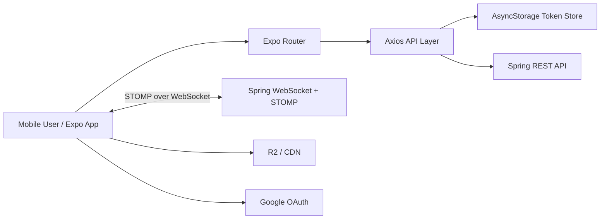

# shathing-app

지역 기반 물건 공유 서비스를 위한 모바일 앱 프로젝트입니다.  
`Expo Router`와 `React Native`를 기반으로 공유글 탐색/상세/작성, 인증, 앱 설정, 1:1 실시간 채팅 MVP를 구현했습니다.

## 프로젝트 개요

이 프로젝트의 목적은 "필요할 때만 빌려 쓰고, 쓰지 않는 물건은 이웃과 공유한다"는 흐름을 모바일 앱으로 구현하는 것입니다. 웹 프론트엔드에서 만든 공유 서비스 흐름을 앱 환경에 맞게 옮기면서, 모바일 사용자가 공유글을 탐색하고, 글을 작성하고, 상대와 바로 채팅할 수 있는 경험을 목표로 삼았습니다.

앱에서 특히 신경 쓴 부분은 웹과 다른 모바일 환경의 제약입니다. 인증 토큰 저장, Expo/React Native의 라우팅 구조, 사진 선택 권한, 로컬 네트워크 API 연결, WebSocket/STOMP frame 전송 방식처럼 앱에서 직접 마주치는 문제를 실제 백엔드와 맞춰 구현했습니다.

백엔드와 맞닿는 부분은 REST API, DTO, STOMP destination, Google OAuth ID token 검증 방식을 기준으로 연동했습니다. 앱 내부에서는 API 계층, 타입, 공통 UI, 도메인 유틸을 분리해 화면 코드가 지나치게 많은 책임을 갖지 않도록 정리했습니다.

## 기술 스택

### App

- `Expo 54`
- `React Native 0.81`
- `React 19`
- `TypeScript`
- `Expo Router`

### State / Data

- `axios`
- `@react-native-async-storage/async-storage`
- `@tanstack/react-query`

### Auth / Media / Realtime

- `expo-auth-session`
- `expo-web-browser`
- `expo-image-picker`
- `expo-image`
- Native `WebSocket` + STOMP frame handling

### UI / Platform

- `@react-navigation`
- `expo-symbols`
- `@expo/vector-icons`
- `react-native-safe-area-context`

## 아키텍처

아래 구조로 앱, 백엔드, 실시간 채팅, 이미지 CDN을 분리했습니다.



핵심 포인트:

- `app/(tabs)`에서 홈, 글쓰기, 채팅, 설정 탭을 구성
- `app/share/[id].tsx`와 `app/chat/[id].tsx`에서 상세 화면을 별도 라우트로 분리
- `apis`와 `types`를 분리해 API 계층과 DTO 타입을 관리
- 인증 토큰은 `AsyncStorage`에 저장하고, Axios interceptor에서 `Authorization: Bearer`로 전송
- 채팅은 REST로 초기 데이터 조회, WebSocket/STOMP로 실시간 메시지 수신
- Expo Go/native 환경에서 STOMP frame은 binary로 전송하고, web에서는 text frame으로 전송
- 공통 UI와 도메인 유틸은 `components`, `hooks`, `lib`로 분리

## 주요 기능

### 1. 공유글 목록 / 상세

- 공유글 목록 조회
- 지역 / 카테고리 필터링
- 검색어 기반 목록 조회
- 공유글 상세 조회
- R2/CDN 이미지 로딩

### 2. 공유글 작성 / 수정

- 인증 사용자만 글 작성 가능
- 제목, 내용, 지역, 카테고리 입력
- 사진 보관함 권한 요청 및 이미지 선택
- Presigned URL 기반 이미지 업로드
- 기존 공유글 수정 및 삭제

### 3. 인증

- 이메일 인증 토큰 로그인
- Google OAuth ID token 로그인
- Access token / refresh token 저장
- Axios 요청에 `Authorization: Bearer {accessToken}` 자동 첨부
- 비로그인 사용자는 글쓰기/채팅 화면에서 로그인 안내 표시

### 4. 1:1 채팅 MVP

- 채팅방 목록 조회: `GET /chat/rooms`
- 메시지 조회: `GET /chat/rooms/{roomId}/messages`
- 이전 메시지 페이징
- 실시간 구독: `/topic/chat/rooms/{roomId}`
- 메시지 전송: `/pub/chat/rooms/{roomId}/messages`
- 앱 native 환경에서 STOMP frame binary 전송 처리

현재는 MVP 단계라 읽음 처리, 안 읽은 개수, 푸시 알림, 채팅방 검색, 다중 인스턴스 fan-out은 포함하지 않았습니다.

### 5. 설정 / 앱 환경

- 사용자 정보 확인
- 이메일 로그인 / Google 로그인 / 로그아웃
- 언어 설정
- 라이트 / 다크 / 시스템 테마 설정

## 기여도와 역할

앱 기준으로 전체 구조 설계와 구현을 담당했습니다.

- Expo Router 기반 탭/상세 라우팅 구성
- 공유글 목록/상세/작성 화면 구현
- 앱 인증 흐름과 토큰 저장/전송 구조 구현
- Spring REST API와 DTO 기준 연동
- Google OAuth ID token 로그인 연동
- Spring STOMP 백엔드와 연결되는 채팅 UI 구현
- Expo Go/native WebSocket frame 전송 이슈 해결
- R2/CDN 이미지 로딩 및 사진 업로드 흐름 구현
- 공통 UI, 인증 가드, STOMP 유틸, 메시지 유틸 정리
- README 및 디자인 시스템 문서화

## 결과 및 성과

이 프로젝트를 통해 웹 서비스 흐름을 모바일 앱으로 옮기면서, 앱 환경에서 필요한 인증, 라우팅, 권한, 실시간 연결 문제를 실제로 해결했습니다.

- 홈 -> 공유글 상세 -> 채팅으로 이어지는 사용자 흐름 구현
- 로그인 -> 글쓰기 -> 이미지 업로드 -> 게시 흐름 구현
- REST + STOMP를 조합해 초기 데이터 조회와 실시간 업데이트를 분리
- Expo Web과 Expo Go/native 모두에서 채팅 연결이 가능하도록 STOMP 전송 방식 조정
- API 타입, 공통 UI, 도메인 유틸을 분리해 화면 코드의 책임 축소

정량적 서비스 지표(사용자 수, 전환율, 체류 시간 등)는 아직 운영 단계가 아니라 별도로 수집하지 않았습니다. 대신 기능 완성도, 백엔드 연동 안정성, 앱 환경 대응, 코드 구조 개선을 중심으로 성과를 정리했습니다.

## 그외

### 향후 계획

- 읽음 처리 / 안 읽은 메시지 개수
- 푸시 알림
- 공유글과 채팅방 연동 UX 고도화
- 채팅방 생성 UX 개선
- 메시지 전송 실패 재시도
- 이미지 업로드 진행률 표시
- EAS development build / production build 환경 정리
- 테스트 코드 추가

### 프로젝트를 통해 배운 점

- Expo Go, web, development build는 OAuth redirect와 WebSocket 동작이 다를 수 있다는 점
- React Native WebSocket에서 STOMP text frame이 서버에서 예상대로 파싱되지 않을 수 있어 native 전송 방식을 별도로 고려해야 한다는 점
- 모바일 앱에서는 `localhost` 대신 실제 기기에서 접근 가능한 LAN IP/API URL을 명확히 관리해야 한다는 점
- 인증이 필요한 화면은 화면 내부 조건 분기뿐 아니라 API 호출 시작 전에도 막아야 한다는 점
- 화면 코드에 프로토콜 구현과 포맷팅 로직이 섞이면 변경 비용이 커져, `lib`로 분리하는 편이 유지보수에 유리하다는 점

### 개선점

- 현재 채팅방 상세에서 채팅방 정보를 목록 API에서 찾아오고 있어, 장기적으로는 단일 채팅방 조회 API를 두는 편이 좋습니다.
- Google OAuth는 Expo Go, web, development build마다 redirect URI와 client ID 관리 방식이 달라 빌드 환경별 설정 문서가 더 필요합니다.
- 현재 자동화 테스트는 충분하지 않아, 핵심 사용자 흐름 기준의 테스트를 추가할 필요가 있습니다.
- API error message와 loading UX는 더 일관되게 다듬을 여지가 있습니다.

## 실행 방법

### 설치

```bash
bun install
```

### 환경변수

`.env`

```env
# API
EXPO_PUBLIC_API_URL=http://192.168.0.32:8080

# Google OAuth
EXPO_PUBLIC_GOOGLE_CLIENT_ID=your-web-client-id.apps.googleusercontent.com
# Optional
EXPO_PUBLIC_GOOGLE_IOS_CLIENT_ID=
EXPO_PUBLIC_GOOGLE_ANDROID_CLIENT_ID=
EXPO_PUBLIC_GOOGLE_WEB_CLIENT_ID=

# Chat
EXPO_PUBLIC_CHAT_WS_URL=ws://192.168.0.32:8080/ws-chat

# R2 / CDN
EXPO_PUBLIC_R2_BASE_URL=https://cdn.example.com/
```

모바일 기기에서 Expo Go로 실행할 때는 `localhost`가 아니라 개발 PC의 LAN IP를 사용해야 합니다.

### 실행

```bash
bun run start
```

플랫폼별 실행:

```bash
bun run ios
bun run android
bun run web
```

## 검증

```bash
npx tsc --noEmit
bun run lint
```

현재 별도 단위 테스트/통합 테스트 스크립트는 구성되어 있지 않습니다.
